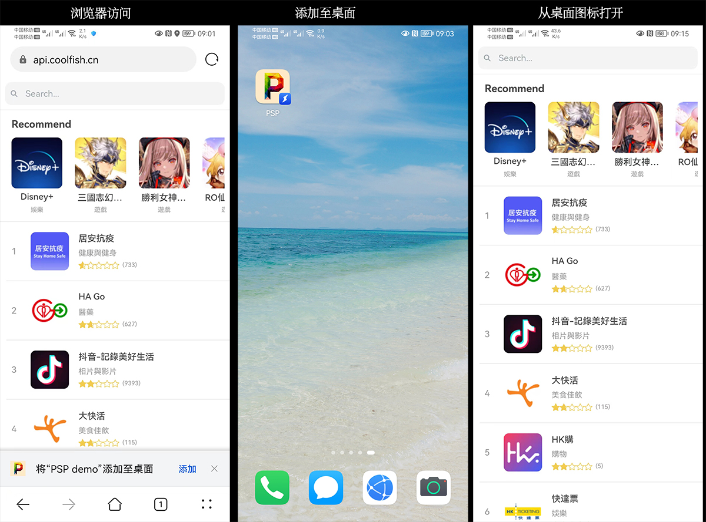

### 一个基于React开发的 PWA（Progressive Web App) demo




DEMO地址：<a href="https://api.coolfish.cn">https://api.coolfish.cn</a>（推荐用移动设端浏览）

- 联网的时候访问，会缓存相关数据
- 缓存之后，在无网络的情况下访问，会直接从缓存中获取数据来渲染界面
- 如果没有缓存的图片资源，在无网络的情况下会显示默认图片

----

  ### 本地开发


  ```
  $ git clone git@github.com:pengsp/pwa-demo.git
  $ yarn
  $ yarn start
  ```
打开浏览器访问 <a href="http://localhost:3000">http://localhost:3000</a>

### 打包
```
yarn build
```

### 测试用例
```
yarn test
```

---


#### 数据来源

 推荐列表： `https://itunes.apple.com/hk/rss/topgrossingapplications/limit=10/json`

最受欢迎的免费APP列表：`https://itunes.apple.com/hk/rss/topfreeapplications/limit=100/json`

 APP详细信息查询： `https://itunes.apple.com/hk/lookup?id=${id}`
  
  ----

### 注意事项

 APP详细信息查询的接口（`https://itunes.apple.com/hk/lookup?id=${id}`）
 
 会出现`http://localhost:3000`请求成功，但是`http://192.xxx.xxx.xxx:3000`再去请求会报跨域错误，同时线上部署的也会出现跨域错误，而线上能访问的时候，本地的又会访问不了。
 
 缓存逻辑比较奇怪，疑似缓存规则同时绑定IP和域名，导致当请求参数一致的时候，同一IP同时只能有一个域名访问该接口。

 一般来说我们在URL上加一个随机数就可以解决问题，但是PWA需要实现离线缓存是实用URL做key来缓存数据的，那么导致我们的URL也不能每次都变化。所以我的解决方案是在请求的URL上加上版本号，这样每一个版本的请求不一样，就能各种命中各种的缓存，返回正确的数据。

 在`package.json`中的编译命令做了修改，每次执行的时候会生成一个“版本号”，然后打包的代码获取到版本号编译到代码里去，确保没一个版本的`lookup`版本参数会不一样。
 ```
    "start": "echo  REACT_APP_CACHE_VERSION=`date '+%m%d%H%M%S'`$RANDOM > .env.development && react-scripts start",
    "build": "echo  REACT_APP_CACHE_VERSION=`date '+%m%d%H%M%S'`$RANDOM > .env.production && react-scripts build",
    
 ```
